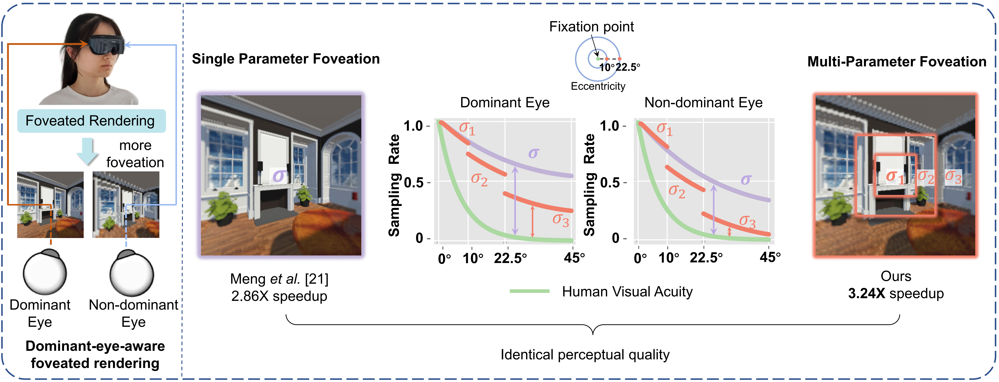

# DEAMP: Dominant-Eye-Aware Foveated Rendering with Multi-Parameter Optimization

Unity Demo Code of DEAMP (IEEE ISMAR 2023). Tested on Unity 2020.3.8f1 and SteamVR v2.7.3.

## Abstract

The increasing use of high-resolution displays and the demand for interactive frame rates presents a major challenge to widespread adoption of virtual reality. Foveated rendering address this issue by lowering pixel sampling rate at the periphery of the display. However, existing techniques do not fully exploit the feature of human binocular vision, *i.e.*, the dominant eye. We propose a Dominant-Eye-Aware foveated rendering method optimized with Multi-Parameter foveation (DEAMP). Specifically, we control the level of foveation for both eyes with two distinct sets of foveation parameters. To achieve this, each eye's visual field is divided into three nested layers based on eccentricity. Multiple parameters govern the level of foveation of each layer, respectively. We conduct user studies to evaluate our method. Experimental results demonstrate that DEAMP is superior in terms of rendering time and reduces the disparity between pixel sampling rate and the visual acuity fall-off model while maintaining the perceptual quality.

## Pipeline Illustration

## Install

* Clone this repo and open the DEAMP folder using Unity 2020.3.8f1.

* Import SteamVR Unity Plugin from the unity asset store. (If needed)

(Or get access from github: [Release SteamVR Unity Plugin v2.7.3 (sdk 1.14.15) · ValveSoftware/steamvr_unity_plugin (github.com)](https://github.com/ValveSoftware/steamvr_unity_plugin/releases/tag/2.7.3))

## Usage

This is a demo for binocular vision, please use with a VR headset. 

You may control the parameters by keyboard keys:

* **O**: Show a red line to indicate the layer boundaries.
* **LeftArrow, RightArrow, DownArrow, UpArrow**: Control the position of the fixate point.

* **D:** Set which eye is the dominant eye, 'l' for left and 'r' for right.
* **X:** Switch mode. There are 2 modes:
  * **"dom"**: Level of foveation increases in all 2 eyes, the goal is to determine the parameters of the dominant eye.
  * **"nondom"**: Level of foveation increases only in the non-dominant eye, the goal is to determine the parameters of the non-dominant eye after determining the parameters of the dominant eye.

#### Level of foveation (the blurred eye depends on dominant eye and mode settings)

* **F**: Increase the level of foveation of the all 3 layers (fovea, mid-periphery, periphery).
* **M**: Increase the level of foveation of the outer 2 layers (mid-periphery, periphery).
* **P**: Increase the level of foveation of the periphery layer.

You can use the *inspector* window of a GameObject named *DisplayL* and *DisplayR* for finer adjustments.

You can also adjust the angle range of the 3 layers using the *inspector* window of *DisplayL* and *DisplayR*.

## Note

* Please ensure the resolution settings in "Game" window is set to 1024×1024, if you want to change the display resolution, modify the size of "TexturePass0.renderTexture" as well.